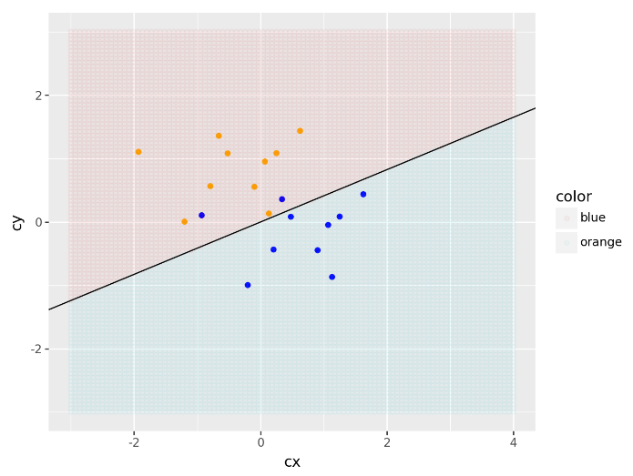

# Statistical Learning

## Outline

This folder contains a recreation of the graduate class of Statistical Learning instructed by Professor Tamer Oraby at The University of Texas Rio Grande Valley with the classic book guide [Elements of Statistical Learning (ESL)](https://link.springer.com/book/10.1007/978-0-387-84858-7).

The intention of this notebook is performing the coding not in R, software used by Professor Tamer but in Python using classic Machine Learning libraries but also new ML approaches using tensors such as Tensorflow. 

## Content

1. Supervised Learning:

    1.1. The first notebook outline how to re-create the linear model in a classification context example from page 12. 
    
    Here, we generate a random matrices using `numpy.random.multivariate_normal` for both orange and blue colored points. To be as loyal as possible to the Professor Oraby philosophy we must try avoid as much as possible `for-loop`, which here I decide to replace by `map` built-in function. Indeed, for the `expand.grid` function in R, I replaced by the github gist function [proposal](https://gist.github.com/fauxneticien/2ff31c5ec32e2545e9bf749fc9b15d08).

    Additionally, as we are performing a classification task the classification threshold must be 0.5.

    **NOTE**: For replication, I used seeds for built-in functions and Numpy functions.

    

        
    

    1.2. The `sklearn` library is primarily used for Machine Learning tasks rather than statistics tasks. It is designed to quickly perform basic Machine Learning calculations for supervised and unsupervised learning modeling. In class, Professor Tamer chose to perform a more thorough data extraction, and for this purpose, he calculated metrics such as `anova`. In such cases, we should use the `statsmodels.formula.api` library to build the linear regression model.

    When performing the polinomial integration to the linear regression for checking non-linear interactions in between variables we use the `PolynomialFeatures` from the `sklearn.preprocessing` library. 
    

